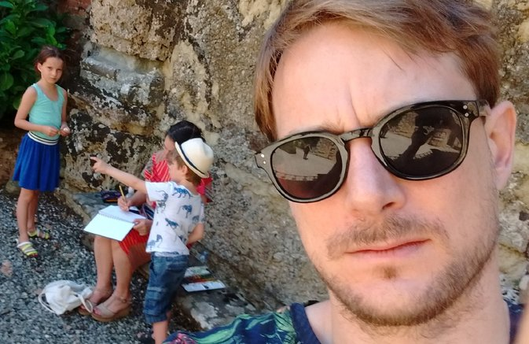

 
  

    
 I am an INRAE Senior
    	  Researcher in statistics co-leading the lab <a
    	  href="https://www6.inrae.fr/mia-paris">UMR 518 Université
    	  Paris-Saclay/AgroParisTech/INRAE</a>.
    

    

    My research mainly focuses on <strong>Statistical
    learning</strong> (sparse methods, latent variable models, clustering, graphical models, ...) applied to the analysis of data from life
    sciences, more particularly <strong>omics data</strong>. More on this can be found in my
    <a href="doc/hdr_chiquet.pdf">Habilitation à diriger les recherches</a>.
    

    

    <a href="doc/cv_en_202004.pdf"> Here is a full academic CV (April 2020)</a>
    

    

    
    
 

Contact information
-------------------

 
  

<address>
  <strong>MIA Paris</strong> 
  Université Paris-Saclay, AgroParisTech, INRAE 
  16 rue Claude Bernard 
  75231 Paris Cedex 05, France   
   +33(0)1 44 08 18 39  
   <a href="mailto:julien [dot] chiquet [at] inrae [dot] fr">julien [dot] chiquet [at] inrae [dot] fr</a>
  
<a itemprop="sameAs" content="https://orcid.org/0000-0002-3629-3429" href="https://orcid.org/0000-0002-3629-3429" target="orcid.widget" rel="noopener noreferrer" style="vertical-align:top;">orcid.org/0000-0002-3629-3429</a>

</address>

