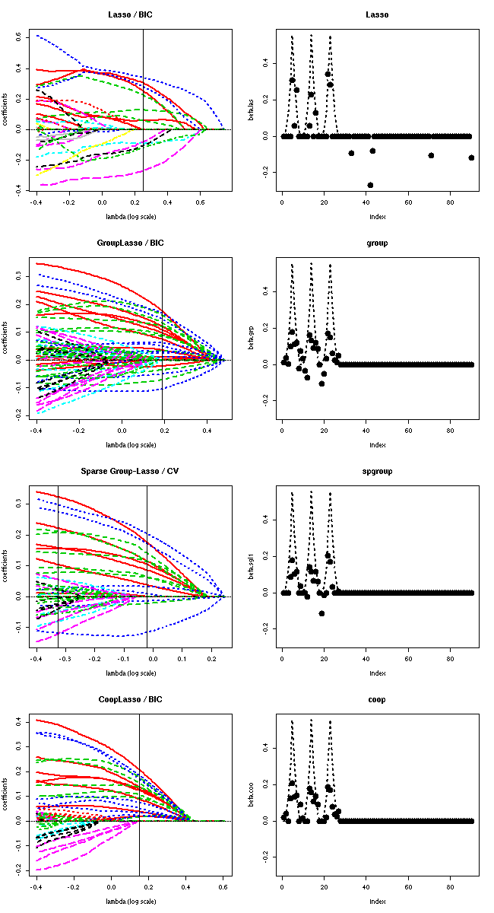

### Context

The *scoop* (Sparse cooperative regression) `R` package fits
coop-Lasso, group-Lasso and Lasso solution paths for linear regression
and logistic regression. The cooperative-Lasso (in short coop-Lasso)
may be viewed as a modification of the group-Lasso penalty that
promotes sign coherence and that allows zeros within groups.

### Download

<a href="doc/scoop/scoop-manual.pdf">
 R manual (uncomplete)
</a>

<a href="doc/scoop/scoop_0.2-1.tar.gz">
 package sources
</a>

<a href="doc/scoop/scoop_0.2-1.tar.gz">
 windoz binary version
</a>

To install, run `R CMD INSTALL scoop_0.x-x.tar.gz` in a terminal (tested on Linux ubuntu and Mac OS 10.9).

### R code to reproduce some Figures of [the journal paper](http://arxiv.org/pdf/1103.2697.pdf)

#### Basal tumor

Just launch the demo script linked to the package: in `R`,

~~~ 
library(scoop)
demo(basal_tumor)
~~~

#### Breiman experiments

Launch the following script to produce Figure 5 of the paper (see below). Needs ''scoop'' package installed.

~~~ 
rm(list=ls())
library(scoop)
##BREIMAN    Breiman sample generator for testing linear regression.
##  [X,Y,BETA] = BREIMAN(CORR,H,T,SEED) produces a sample of 60 (X,Y) 
##  pairs, of 30 covariates X(i,:) and one explained variable Y(i). 
##  X is drawn from a multivariate normal distribution N(0,S2),
##  where S2(i,j) = CORR^abs(i-j). 
##  CORR (default = 0) should be in the range [-1 1];
##  Y = X * BETA + EPSILON
##  EPSILON is drawn from a normal distribution N(0,1)
##  BETA is the sum of three waves centered in 5, 15 and 25:
##  BETA(k+i) = C*(H-i)^2 , with abs(i) < H, k = [ 5 15 25], where 
##  C is a constant such that the  R^2 is about 0.75, and
##  H (default = 1) is an integer governing the wave width (within-group
##  sparsity).  H should be in {1,2,3,4,5} (corresponding to {3,9,15,21,27}
##  non-zero coefficients).
##  T (default = 3) sets the number of active groups. T should be in {1,2,3}. 
##  Default is the original Breiman setup
##  SEED is an optional parameter selecting the seed of the normal 
##  pseudo-random generator used to generate X and EPSILON.

## References:
## Breiman, L., Heuristics of instability and stabilization in model 
## selection, The Annals of Statistics, 24(6), pp 2350--2383, 1996.
breiman_coop <- function(corr=0, h=3, T=4, N = 40) {
                                        # seed=set.seed(floor(runif(1,1:10000)))) {

  d <- 90          # variables
  K <- c(5,14,23,31,40,49,58,67,77,86)  # cluster centers
  
  X    <- matrix(rnorm(N*d),N,d);
  EXX  <- corr^abs(cbind(1:d) %*% rep(1,d)-cbind(rep(1,d)) %*% c(1:d))
  out  <- eigen(EXX)
  D    <- diag(out$values)
  V    <- out$vectors
  X    <- X %*% sqrt(abs(D)) %*% t(V)  # just in case
  beta <- rep(0,d)

  for (i in 1:length(K)) {
    wave <- pmax( 0 , h - abs(cbind(1:d)-K[i]) )
    beta <- beta + wave^2
  }

  ## keep only t waves (group sparsity)
  if (T <=10 & T >= 0) {
    beta[c((T*9+1):d)] <- 0
  } else {
    stop("T should be in {1,...,10}")
  }

  noise <- rnorm(N,0,1)        # additive noise
  beta <- beta %*% sqrt(3/(beta %*% EXX %*% beta)) # beta normalization R2 = 0.75
  y <- X %*% beta + noise  # compute output

  R2 <- 1-sum(noise^2)/sum((y-mean(y))^2)
  
  return(list(X = X, y = y, beta = beta, R2 = R2))
} 

## ====================================================================

rm(list=ls())
library(scoop)
source("breiman.R")

## 999
set.seed(111)

## T = 3->8
## corrélation -: encore pire
## grande dimension ++ 

## d = 90, 10 groupes de 9, T groupes actifs
##
## plus h est grand, plus favorable ou group-Lasso
## plus h est petit, plus favorable ou Lasso
##
h <- 4
data <- breiman_coop(corr=0.4,h=h,T=3,N=45)

x <- data$X
y <- c(data$y)
beta.star <- data$beta
group <- rep(1:10,each=9)

## Lasso
cat("\n--------------------\n")
cat("Lasso\n")
las <- lasso(x, y, intercept=FALSE, lambda.min=0.4)
las@group <- group

## Group-Lasso
cat("\n--------------\n")
cat("Group-Lasso\n")
grp <- group.lasso(x, y, group, intercept=FALSE, lambda.min=0.4)

## Coop-Lasso
cat("\n--------------------\n")
cat("Cooperative-Lasso\n")
coo <- coop.lasso(x, y, group, intercept=FALSE, lambda.min=0.4)

## Sparse group-Lasso
cat("\n--------------------\n")
cat("Sparse group-Lasso\n")
sgl <- sparse.group.lasso(x, y, group, intercept=FALSE, lambda.min=0.4)

## compute BIC
sgrp <- selection(grp, sigma2=1)
scoo <- selection(coo, sigma2=1)
slas <- selection(las, sigma2=1)
ssgl <- crossval(sgl, K=5)
beta.las <- slas$beta.BIC
beta.grp <- sgrp$beta.BIC
beta.coo <- scoo$beta.BIC
beta.sgl1 <- ssgl@beta.1se
beta.sgl2 <- ssgl@beta.min

lambda.las <- slas$lambda.BIC
lambda.grp <- sgrp$lambda.BIC
lambda.sgl1 <- ssgl@lambda.1se
lambda.sgl2 <- ssgl@lambda.min
lambda.coo <- scoo$lambda.BIC
t.grp    <- "GroupLasso / BIC"
t.coo    <- "CoopLasso / BIC"
t.sgl    <- "Sparse Group-Lasso / CV"
t.las    <- "Lasso / BIC"

lim <- range(c(beta.star, beta.las, beta.sgl1, beta.sgl2, beta.grp))

x11(width=7,height=12)
par(mfrow=c(4,2))
## lasso
plot(las, main=t.las, lwd=2)
abline(v=log10(lambda.las))
plot(beta.las, main="Lasso", pch=16, ylim=lim, cex=2)
lines(beta.star, lty=3, col="black", lwd=2)
## group-lasso
plot(grp, main=t.grp, lwd=2)
abline(v=log10(lambda.grp))
plot(beta.grp, pch=16, main="group", ylim=lim, cex=2)
lines(beta.star, lty=3, col="black", lwd=2)
## sparse group-lasso
plot(sgl, main=t.sgl, lwd=2,
     col = 1+c(group),
     lty = c(group))
abline(v=log10(lambda.sgl1))
abline(v=log10(lambda.sgl2))
plot(beta.sgl1 , pch=16, main="spgroup", ylim=lim, cex=2)
lines(beta.star, lty=3, col="black", lwd=2)
## coop lasso
plot(coo, main=t.coo, lwd=2)
abline(v=log10(lambda.coo))
plot(beta.coo, pch=16,  main="coop", ylim=lim, cex=2)
lines(beta.star, lty=3, col="black", lwd=2)
~~~

